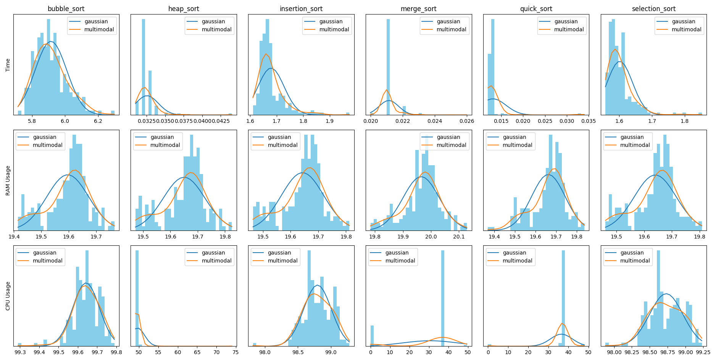
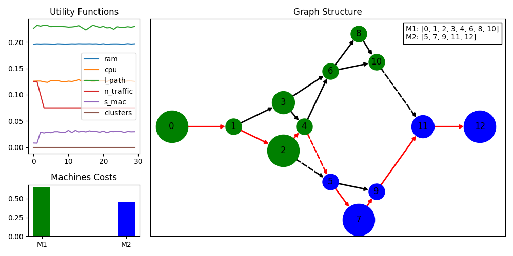

# Resource/Task Simulation and Optimization using Genetic Algorithms


## Installation & Usage

The tool requires the previous installation of Python3 and their package installer, pip.
After guarantee the Python3 installation, you're able to clone the repository and install via pip the Python3 requirements.
Then, you can check the help message to understand the usage of that tool.

```bash
# requirements installation
pip install --user -r requirements.txt

# display the help message
python simulation/main.py -h

usage: main.py [-h] [-g graph] [-t task_req] [-m machines_specs]
               [-p profile_data] [-o opt_param report] [-s placement]
               [-d machine_type]

optional arguments:
  -h, --help           show this help message and exit
  -g graph             graph description JSON path
  -t task_req          task requirements JSON path
  -m machines_specs    machine specifications JSON path
  -p profile_data      dataset (CSV file) collected from the profiled tasks
  -o opt_param report  optimize the current setup, using the optimization
                       parameters defined in a JSON file and storing the
                       output report in another JSON file
  -s placement         simulate the placement defined in the JSON file, the
                       resulting output is stored in the same file
  -d machine_type      plots the machine distributions for the given machine
                       type
```

Regarding the output of the help command, that tool has 3 different operation modes:
1. **Task Behavior Modeling**: Based on the task profiling dataset models the probability distributions, that 
characterize the behavior of a particular task in each machine;
2. **Placement Optimization**: Using the the graph setup, the machine specs and the task requirements files, 
executes the genetic algorithm to optimize the task placement using the parameters defined in a particular file, 
and producing an output report with the results;
3. **Graph Simulation**: Performs the simulation to a single placement retuning the output metrics 
of the simulator.

### Task Behavior Modeling

```bash
# fit and display the machine distributions
python simulation/main.py -p resources/profiling/profiling_results.csv \
                          -t resources/profiling/task_req.json \
                          -d ubuntu_pc
```



### Placement Optimization

```bash
# optimize the graph pipeline
# using the specified parameters
# and producing the report in the defined json
python simulation/main.py -g resources/graphs/graph.json \
                          -t resources/profiling/task_req.json \
                          -m resources/machine_specs/machines_specs.json \
                          -o resources/opt_param.json resources/opt_report.json
```



### Graph Simulation

```bash
# simulates different types of pipelines configurations
python simulation/main.py -t resources/profiling/task_req.json \
                          -s resources/sim_place.json
```

## Citations

Please use the following citation, or the BibTex entry (if you are using LaTex) for citation purposes:

- E. Pereira, J. Reis, R. J. F. Rossetti and G. Gonçalves, "A Zero-Shot Learning Approach for Task Allocation Optimization in Cyber-Physical Systems," in IEEE Transactions on Industrial Cyber-Physical Systems, vol. 2, pp. 90-97, 2024, doi: 10.1109/TICPS.2024.3392151.

```
@ARTICLE{treao_article,
  author={Pereira, Eliseu and Reis, João and Rossetti, Rosaldo J. F. and Gonçalves, Gil},
  journal={IEEE Transactions on Industrial Cyber-Physical Systems}, 
  title={A Zero-Shot Learning Approach for Task Allocation Optimization in Cyber-Physical Systems}, 
  year={2024},
  volume={2},
  pages={90-97},
  doi={10.1109/TICPS.2024.3392151}
}
```
